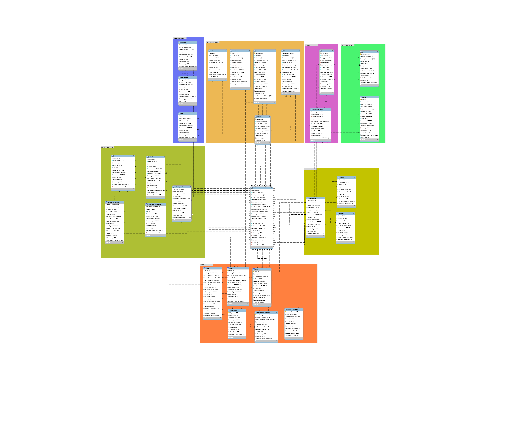

# ✈️ Airport Management Database (MySQL 8)

> **Proyecto:** Aerolínea – Sistema de Gestión de Vuelos, Reservas y Operaciones  
> **Motor:** MySQL 8.x  
> **Autor:** Agustín Tejero  
> **Diseño:** ERD normalizado (3FN) + auditoría + eliminación lógica (soft delete)

## Tecnologías
MySQL 8 · SQL · Modelado relacional · 3NF · ERD · PK/FK · Índices · RBAC · Vistas · Stored Procedures · Triggers · Auditoría · Soft Delete

---

## ✅ Highlights técnicos

- **Modelo 3FN** orientado a operación real: flota, rutas, vuelos, reservas, asientos y ticketing.
- **RBAC**: roles/permisos (`rol`, `permiso`, `rol_permiso`).
- **Auditoría estándar** en tablas: `creado_en`, `actualizado_en`, `eliminado_en` + `creado_por`, `actualizado_por`, `eliminado_por`.
- **Soft delete** para trazabilidad sin perder histórico.
- **Integridad referencial** con FKs e índices para consistencia y performance.
- **Ejecución reproducible con Docker** (schema + seed + views + functions + procedures + triggers).

---

## 🗺️ Diagrama ERD



---

## 📘 Resumen funcional

El esquema `Aerolinea` cubre las piezas base de una aerolínea:

- Identidad de usuarios y control de accesos.
- Catálogos geográficos y estructura aeroportuaria (países, aeropuertos, terminales, puertas).
- Flota (modelos, aeronaves, asientos, configuración de cabina).
- Operación (rutas, vuelos, estado de asientos por vuelo).
- Comercial (tarifas, promociones).
- Venta y post-venta (reservas, pasajeros asociados, boletos).

---

## 🗂️ Tablas principales (por módulo)

| Módulo | Tablas | Notas |
|---|---|---|
| Seguridad y accesos | `usuario`, `rol`, `permiso`, `rol_permiso` | Auth + autorización por roles. |
| Identidad | `persona`, `direccion`, `telefono`, `documentacion` | Datos personales y contacto. |
| Aeropuertos | `pais`, `aeropuerto`, `terminal`, `puerta` | Infraestructura. |
| Flota | `modelo_aeronave`, `aeronave`, `asiento`, `configuracion_cabina` | Aeronaves y cabina. |
| Operación | `ruta`, `vuelo`, `asiento_vuelo` | Planificación y disponibilidad. |
| Comercial | `tarifa`, `promocion` | Precios/beneficios. |
| Reservas & ticketing | `reserva`, `reserva_persona`, `boleto` | Reserva → asiento → boleto. |
| Tripulación | `tripulacion`, `tripulacion_miembro`, `rango_tripulacion` | Estructura y asignación. |

---

## 🔄 Flujo típico (end-to-end)

1. Un `usuario` opera según su `rol`.
2. Vincula identidad: `persona`, `direccion`, `telefono`, `documentacion`.
3. Consulta rutas/vuelos: `ruta` + `vuelo`.
4. Define condiciones comerciales: `tarifa` + `promocion`.
5. Genera `reserva` y pasajeros en `reserva_persona`.
6. Reserva asiento en `asiento_vuelo` (estado).
7. Emite `boleto` asociado a vuelo/pasajero/asiento.
8. Todas las operaciones quedan auditadas (`*_en`, `*_por`) y con soft delete (`eliminado_en`).

---

## 🐳 Ejecución con Docker (recomendado)

### Requisitos
- Docker + Docker Compose

### Iniciar docker y desde la raiz del proyecto levantar la base

- docker compose up -d
- docker compose logs -f db
  ### Luego en otra terminal podes ejecutar los scripts:
   - bash scripts/smoke-test.sh
   - bash scripts/db-shell.sh   

### 1) Configurar entorno
```bash
cp .env.example .env